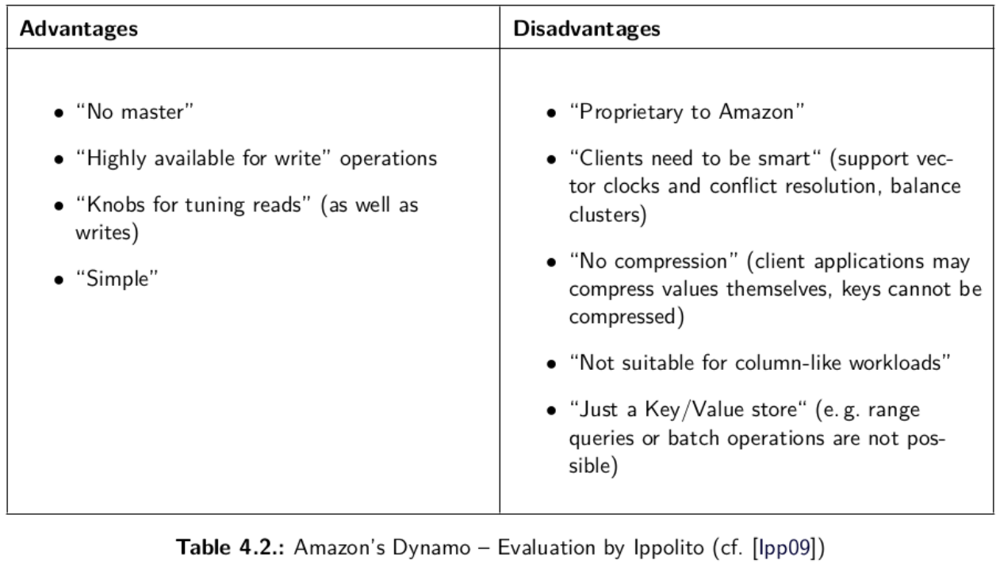

### Key-value NoSQL databases

#### key-value datastores

Simplest form of NoSQL databases via a map/dictionary that allows clients to put and request values per key. High scalability over consistency.  

Keys are identified by values.  
Values are stored alongside with keys.  
Flexible when storing values.  

#### Limitations

Can only lookup values by key.  
Some don't support range queries (like selecting records with dates between a start and end date or names in some range of the alphabet).  
No standard query language.  

#### Amazon's Dynamo

Infrastructure is made up by tens of thousands of servers and network components located in many data centers around the world.  
Commodity hardware is used.  
Component failure is the “standard mode of operation”.  
“Amazon uses a highly decentralized, loosely coupled, service oriented architecture consisting of hundreds of services."  

#### Redis

NoSQL, in-memory, NoSQL key/value store that is used primarily as an application cache or quick-response database.

#### Column datastores

Most complex NoSQL database type.  
Shares similarities to relational databases like rows and columns.  
Column family - group of columns.  
Structured so that all relevant object information is in a single, possibly very wide row.  
All data within a column family is compressed together.
Query languages may look similar to SQL.  
SQL-like terms such as SELECT, INSERT, UPDATE, and DELETE.  
Column family–specific operations, such as CREATE COLUMNFAMILY.  

#### Google's BigTable

Distributed storage system for managing structured data that is
designed to scale to a very large size: petabytes of data across thousands
of commodity servers.  
Incredible scalability.  
Simple administration, handles upgrades and restarts transparently, automatically maintains high data durability.  
Cluster resizing without downtime.  

Advantages:

- time-series data (CPU and memory usage over time over multiple servers).
- marketing data (purchase histories and customer preferences).
- financial data (transactions histories, stock prices).
- IoT data (energy reports from energy meters and home appliances).
- Graph data (how users are connected to one another).

#### BigTable storage model

Each intersection of a row-column can contain multiple cells where each is a unique timestamped version of the data.

### Graph NoSQL databases

#### Graph datastores

Most specialized of all 4 NoSQL databases.  
Structure of nodes and vertices.  
Node is an object that has an identifier and a set of attributes.  
Relationship is a link between two nodes that contain attributes about that relation.

#### Neo4J

"""""Neo4J is a graph database with emphasis on database (full ACID support)."""""  
Schemaless database.  
Not necessary to define table or relationships before adding data.  
Nodes have any properties.  
Any node can relate to any node.

Queried using Gremlin or Cypher.  
Property/ies of a node can be indexed.  
Indexes should be queried to find the starting node to begin transversal.  
Can transverse at any depths.  
Order values of BREADTH_FIRST or DEPTH_FIRST.  
Finding (shortest) paths between two nodes.

Breadth first - starts at the tree root, explores all nodes at the present depth prior to moving on to the nodes at the next depth level.  

Depth first - starts at the root node (an arbitrary node) and explores as far as possible along each branch before backtracking.

Weaknesses:

- can't share, one whole dataset in  a server, only vertical scalability is possible.
- upper bound limit on the graph size, can support tens of billions of nodes, properties and relationships in a single graph.
- no security or data encryption provided at the data level.
- security auditing not available.
