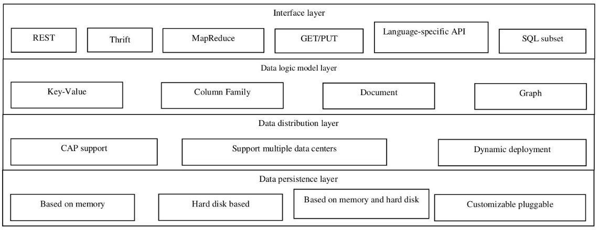
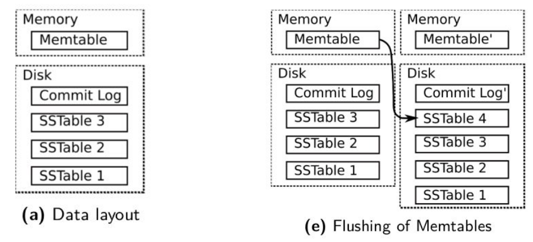
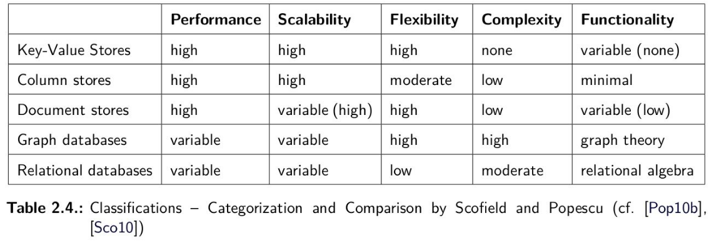

## NoSQL
### Major Companies that started with NoSQL
___
Google -> BigTable

Amazon -> Dynamo

### Concept
___
- Model data logically using an extensible, loosely-coupled data pattern and a multi-node data distribution model.
- Designed to follow the CAP (consistency-availability-partition) tolerance theorem.
- No longer supports ACID features or JOIN operations.
- Data persistence capabilities in disk and/or memory.
- Supports multiple "Non-SQL" interfaces for data access.
- Better performance

### Architecture
___ 

### Features
___
- Easy data dispersion.
- No sharing operation.
- Flexible expansion. 
- Flexible data model.
- Asynchronous replication.

### Classification
___
**Types**:
- key-value
- columnar
- document
- graphical

### What is it?
___
No standard definition movement (less of a technology) mostly open-source databases developed in the 21st century.

**Characteristics**:
- not using relational model
- running well on clusters (w/o ACID)
- open-source (generally)
- built for the 21st century web estates
- schemaless

### Usages
___
Handling data access with sizes and performance that demand clusters.

Need to improve productivity of application development by using a more convenient data interaction style.

### NoSQL vs RDBs
___ 
Data models

Handling concurrency

Fault tolerance

### CAP
___
A system can only choose 2 out of the 3 following characteristics in a shared-data system

#### Consistency
How a system stays in a consistent state after the execution of an operation

#### Availability
How a system stays available even when part of it is down via a crash or maintenance

#### Partition (tolerance)
How a system continues operating even when partitioned via network

### BASE
___
#### **B**asically **a**vailable
Application works basically all the time

#### **S**oft-state
Does not have to be consistent all the time

#### **E**ventual consistency
Will be in some known-state eventually

### Partitioning
___
Large datasets that exceed the capacity of a single machine

Replicating data

#### Memory caches
In-memory databases - replicate most frequently requested parts of a database to main memory, rapidly delivers this data to clients and therefore disburden the database servers significantly

#### Clustering
Of database servers

Helps scale the persistence layer of a system to a certain degree

#### Separating reads from writes
Specify one or more dedicated servers, write-operations for all or parts of the data are routed to (master(s)), as well as a number of replica-servers satisfying read-requests (slaves).

#### Sharding
Type of database partitioning that separates large database into smaller, faster and more easily managed parts.

Partition the data in a way that data typically requested and updated together resides on the same node and that load and storage volume is roughly even distributed among servers.

Mapping between data partitions (shards) and storage nodes that are responsible for these shards.

Downside of sharding operations is that joins between data are not possible, so that the client application or proxy layer inside or outside the database has to issue several requests and postprocess (e.g. filter, aggregate) results instead.

### Storage Layout
___
How the disk is accessed and therefore directly implicate performance.

Which kind of data (e.g. whole rows, columns, subset of columns) can be read en bloque.

#### Row-based
A table of relational model gets serialized as its lines are appended and flushed to disk.

**Advantages**:

- Efficient for transactional workloads (OLTP) where entire rows are read/written.
- Simple to implement and understand.
- Good for queries that access many or all columns of a row.

**Disadvantages**:

- Inefficient for analytical queries (OLAP) that only need a few columns from many rows.
- Poor compression due to heterogeneous data types in a row.

#### Columnar
Serializes tables by appending their columns and flushing them to disk.

**Advantages**:

- Excellent for analytical workloads (OLAP) that scan a few columns over many rows.
- High compression ratios due to similar data types in columns.
- Faster aggregation and vectorized processing.

**Disadvantages**:

- Slower for transactional workloads that require reading/writing full rows.
- More complex to update or insert entire rows.

#### Columnar with Locality groups
Similar to column-based storage but adds the feature of defining so called
locality groups that are groups of columns expected to be accessed together
by clients

#### Log structured merge trees
(LSM-trees) in contrast to the storage layouts explained before do not describe
how to serialize logical data structures (like tables, documents etc.) but how to efficiently use memory and disk storage in order to satisfy read and write
requests in an efficient, performant and still safely manner.

Hold chunks of data in memory (in so called Memtables), maintaining on-disk
commit-logs for these in-memory data structures and flushing the memtables
to disk from time to time into so called SSTables.

### Taxonomies
___
#### By Data Model
Types:
- key-value
- document
- column
- graph

#### Document Database
Documents can be XML, JSON, BSON. These are self-describing, hierarchical tree data structures which can consist of maps, collections and scalar values.

Schema can differ across documents, but they can belong in the same collection.

There are no empty attributes; if a given is not found, it's assumed it wasn't set or not relevant.

Allows for new attributes to be created without the need to define them or to change existing documents.

##### Mongo DB
Multiple databases, multiple collections.

Each document must be specified in what collection to store it in.

##### 
